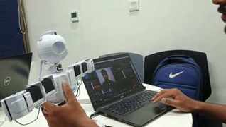

# AEGIS-JD

**Autonomous Engagement & Guardian Intelligence System**

AEGIS-JD is a unified, multimodal AI control system for the **EZ-Robot JD humanoid**. It combines gesture, facial-emotion, body-pose and speech control with conversational AI, object detection, face recognition and a face-recognition-based security gate in one integrated application.

The system was developed as the final project of a **6-week Humanoid Robotics Internship (26 June–7 August 2026)** at the **Educational Robotics Lab, School of Electrical Engineering and Computer Science (SEECS), National University of Sciences & Technology (NUST)**, under the coordination of **Dr. Farkhanda Afzal**.

## What AEGIS-JD Can Do

- **Gesture control** — MediaPipe hand landmarks map seven hand gestures to JD actions.
- **Emotion control** — DeepFace detects dominant facial emotion and triggers a corresponding reaction.
- **Pose control** — MediaPipe pose landmarks map body posture to robot actions.
- **Speech control** — Faster-Whisper transcribes spoken commands locally.
- **Ask JD** — voice/text conversational assistant backed by locally hosted LLaMA models through Ollama.
- **Find Object** — Gemini interprets the request, YOLOv8 detects the target locally, and JD physically scans the scene and points when it finds a match.
- **Face recognition** — DeepFace/Facenet embeddings with cosine similarity identify registered people.
- **Security gate** — face recognition is used as access control so only authorized users can operate the robot.
- **Unified dashboard** — all major modes are available through a browser interface as well as a terminal control center.

## Demo Snapshots

The images below were extracted from the narrated project demonstration.

### Vision-Based Robot Control


### Ask JD Browser Interface


### Face Recognition Demo



## System Architecture

```text
Webcam / Microphone
        |
        v
Perception
MediaPipe | DeepFace | YOLOv8 | Faster-Whisper
        |
        v
Security Gate
Face-recognition authorization
        |
        v
Decision Layer
Rule-based actions | Ollama LLaMA | Gemini
        |
        v
Robot Bridge
EZ-Robot ARC / EZ-Script
        |
        v
EZ-Robot JD physical actions
```

A lightweight **file-based command bridge** connects the Python application to ARC/EZ-Script. Heavy AI dependencies are loaded lazily so a lightweight mode does not pay the startup cost of every model.

## Reliability Features

Gesture, emotion and pose recognition use temporal confirmation rather than acting on a single frame. A reading must remain consistent across **80% of the last 10 frames**, followed by a short cooldown, before an action is sent to JD. This reduces accidental movements caused by noisy one-frame detections.

## My Contribution — Bilal Ahmed, Group Leader

- Built the **gesture, emotion, pose and speech control** modes.
- Co-developed **Ask JD**, including voice and browser interaction.
- Proposed using face recognition as a **security/access-control gate** rather than only an identification feature.
- Integrated the security gate into the final application.
- Led the merge of the independently developed modules into the unified terminal controller and web dashboard.
- Coordinated overall system integration across the team.

## Team

| Member | Role / Contribution |
|---|---|
| **Bilal Ahmed** | Group Leader — gesture, emotion, pose & speech control; Ask JD (co-built); security-gate concept/integration; system integration |
| **Sameen Fatima** | Conversational AI — Ask JD (co-built) |
| **Ahmed** | Perception — object detection & face recognition |
| **Asjid** | Perception — object detection & face recognition |
| **Sajid** | Perception — object detection & face recognition |

## Tech Stack

| Area | Technologies |
|---|---|
| Language / Backend | Python 3, Flask |
| Computer Vision | OpenCV, MediaPipe |
| Face & Emotion AI | DeepFace, Facenet, cosine similarity |
| Object Detection | YOLOv8 / Ultralytics |
| Speech-to-Text | Faster-Whisper |
| Conversational AI | Ollama, LLaMA 3.2, LLaMA 3.1:8B |
| Vision / Language Reasoning | Google Gemini |
| Data & Authentication | Firebase / Firestore |
| Robot Control | EZ-Robot ARC, EZ-Script, file-based command bridge |

## Main Entry Points

- `main_controller.py` — terminal-based unified control center
- `web_dashboard.py` — browser dashboard with live camera/voice modes
- `gesture_control.py` — gesture-based robot control
- `emotion_control.py` — facial-emotion-based robot control
- `pose_control.py` — body-pose-based robot control
- `speech_control.py` — spoken robot commands
- `ask_jd.py` / `voice_jd.py` — conversational AI interfaces
- `object_finder.py` — target-object search and physical scan flow
- `face_recognizer.py` / `face_trainer.py` — recognition and registration
- `face_db.py` / `firebase_config.py` — Firestore-backed identity store

## Setup

```bash
git clone https://github.com/bil332204-code/internship-robots.git
cd internship-robots
python -m venv .venv
pip install -r requirements.txt
```

Install Ollama and pull the models used by Ask JD:

```bash
ollama pull llama3.2
ollama pull llama3.1:8b
```

Copy `.env.example` to `.env` and add your own credentials. Firebase service-account JSON files, API keys, face images and locally generated face-embedding caches should remain local and must not be committed.

Run either:

```bash
python main_controller.py
```

or:

```bash
python web_dashboard.py
```

Physical robot features require an **EZ-Robot JD** connected through **EZ-Robot ARC / EZ-Script**.

## Results

- Reliable real-time gesture, emotion and pose control with debounce/confirmation logic.
- Local speech transcription for robot commands and conversational interaction.
- Working Ask JD assistant with short-term conversation history.
- Working object-search flow combining language understanding, local detection and physical scanning.
- Face-recognition-based security gate restricting robot interaction to authorized users.
- One unified application replacing previously disconnected demonstrations.

## Future Work

- Calibrate face-recognition thresholds across a wider range of lighting conditions.
- Replace the file-based ARC bridge with a persistent socket/WebSocket connection.
- Add per-person permission levels such as administrator and guest.
- Improve offline fallbacks for cloud-dependent reasoning.
- Expand and calibrate gesture, pose and object-interaction behaviors on the physical robot.

## Privacy & Security

This public repository should exclude private API keys, Firebase service-account credentials, personal face-training photos, runtime face embeddings and generated camera snapshots. Use your own local test data when configuring face recognition.

---

**Project:** AEGIS-JD — Autonomous Engagement & Guardian Intelligence System  
**Platform:** EZ-Robot JD Humanoid  
**Internship:** Educational Robotics Lab, SEECS, NUST — Summer 2026
